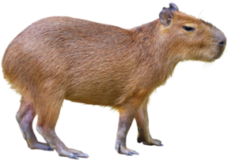

# Capybara 🐾

**Capybara Game** is a small, casual web game where the goal is simple:  
click the capybara as many times as possible before the time runs out.

Each click increases your score by +1.  
There are no complex rules, no progression system, and no competition.  
It was made purely for fun.

 

  

 

## Play online

The game is available online and can be played directly in the browser:

👉 https://capybara-game.pages.dev/

No installation or setup is required.

## About

This project was created as a small experiment and a playful side project.  
It does not aim to be a full game or a long-term product.

The focus is simplicity, quick interaction, and fun.

There are no plans for active development or new features.

## Scope

- Browser-only game  
- No backend  
- No leaderboard  
- No updates planned  
- Made for fun and experimentation

## License 📄

This project is licensed under the  
**PolyForm Noncommercial License 1.0.0**.

Commercial use, resale, and paid services are not permitted.
